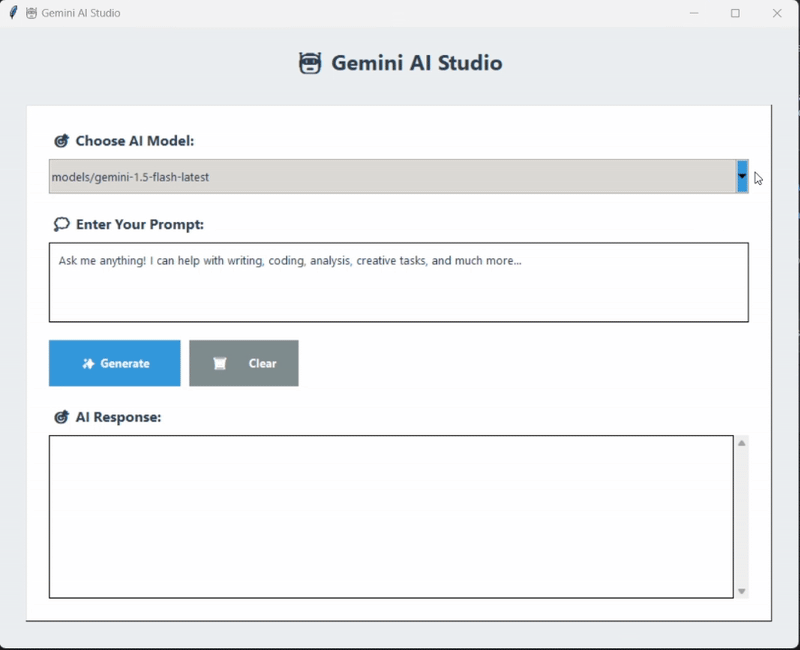

# Gemini-Chat-GUI

 

A small Python Tkinter desktop GUI client for Google Gemini — enter prompts and receive responses.

## Quick Start

1. Clone the repo  
   `git clone git@github.com:Kaveesha125/Gemini-Chat-GUI.git`  
   `cd Gemini-Chat-GUI`

2. Create a `\.env` file in the project root and add your API key:  
   `GEMINI_API_KEY=your_api_key_here`

3. Run the script:  
   `python main.py`

## Demo

---

---
