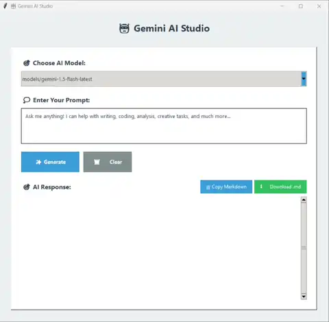
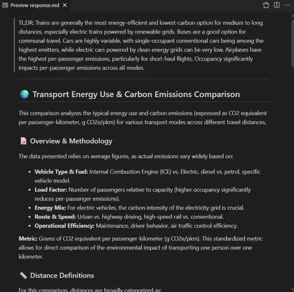

# Gemini-Chat-GUI

 

A small Python Tkinter desktop GUI client for Google Gemini — enter prompts and receive responses, with the ability to download responses as Markdown files.

## Demo

<table>
  <tr>
    <td align="center" valign="top" width="50%">
      
      
Tutorial

    </td>
    <td align="center" valign="top" width="50%">
      
      
Example Output File

    </td>
  </tr>
</table>

---

## Quick Start

1. Clone the repo
   `git clone https://github.com/Kaveesha125/Gemini-Chat-GUI.git`
   `cd Gemini-Chat-GUI`

2. Create a `\.env` file in the project root and add your API key:
   `GEMINI_API_KEY=your_api_key_here`

3. Install dependencies:
   `pip install google-generativeai python-dotenv tkinterweb pyperclip markdown`

4. Run the script:
   `python main.py`

## Features

-   Enter prompts and receive responses from Google Gemini.
-   Display formatted Markdown, including tables, emojis, and colors.
-   Copy Markdown responses to the clipboard.
-   Download responses as Markdown files (`response.md`).
-   Utilizes a separate, editable `system_prompt.py` file for custom system prompts.
